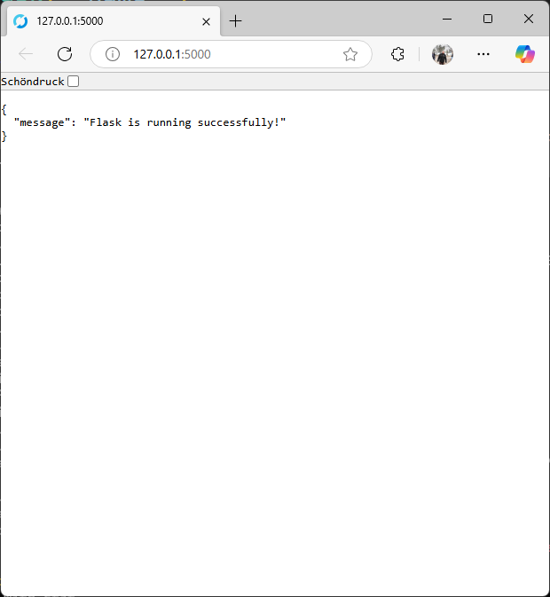

# FastAPI App

This is a simple **FastAPI** application designed to test if FastAPI runs successfully.

## 📌 Features
- A root endpoint (`/`) that returns a success message.
- Easy to extend for additional endpoints.

## 🛠 Installation

To run this project locally, follow these steps:

### 1️⃣ Clone the repository:
```bash
git clone https://github.com/TamerOnLine/.FastAPI.git
cd .FastAPI
```

### 2️⃣ Create a virtual environment (optional but recommended):
```bash
python -m venv venv
source venv/bin/activate  # On macOS/Linux
venv\Scripts\activate  # On Windows
```

### 3️⃣ Install dependencies:
```bash
pip install -r requirements.txt
```

### 4️⃣ Run the FastAPI app:
```bash
uvicorn src.main:app --reload
```

- The app will be accessible at [http://127.0.0.1:8000](http://127.0.0.1:8000).

## 🖼 Screenshots


## 📄 License
This project is licensed under the **MIT License** - see the [LICENSE](LICENSE) file for details.

## 🤝 Contributing
Feel free to fork the repository and submit pull requests if you have any improvements!

## 📬 Contact
For any inquiries, you can reach me at: **info@tameronline.com**
